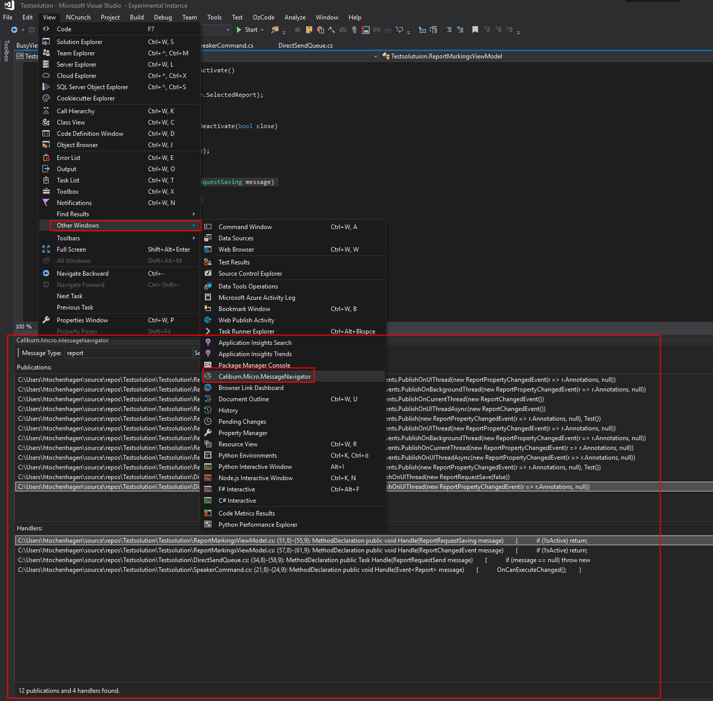

# Caliburn.Micro.MessageNavigator

**Applies to Visual Studio 2017.6 and newer**

Displays all publications and handlers of 'Caliburn.Micro' message types treated according to the search performed.
Nevertheless, the results obtained are without guarantee, since the search is carried out via a regex-expression, which could possibly be too greedy and does not take into account upper and lower case. Definitely some results can be missed in the publications, as there is only a string comparison with the first parameter. If, for example, a differently named variable is used, the publication can not be found. In a future expansion stage, of course, the type of parameter must be checked here.

Clone the repo to test out the sample in Visual Studio 2017 yourself.



## Specify minimum supported version
Since Async Tool Window support is new in Visual Studio 2017 Update 6, we need to specify that our extension requires that version or newer. We do that in the .vsixmanifest file like so:

```xml
<InstallationTarget Id="Microsoft.VisualStudio.Community" Version="[15.0.27413, 16.0)" />
```

*15.0.27413* is the full version string of Visual Studio 2017 Update 6.

See the full sample [.vsixmanifest file](src/source.extension.vsixmanifest).

## This implementation
The code in this sample contains the concepts:

1. [Custom Tool Window Pane](src/ToolWindows/MessageNavigatorToolWindow.cs)
2. [XAML control](src/ToolWindows/MessageNavigatorToolWindow.xaml) for the pane
3. [Custom command](src/Commands/ShowToolWindow.cs) that can show the tool window
4. [AsyncPackage class](src/MyPackage.cs) that glues it all together

Follow the links above directly into the source code to see how it is all hooked up.

## Further reading
Read the docs for all the details surrounding these scenarios.

* [VSCT Schema Reference](https://docs.microsoft.com/en-us/visualstudio/extensibility/vsct-xml-schema-reference)
* [Use AsyncPackage with background load](https://docs.microsoft.com/en-us/visualstudio/extensibility/how-to-use-asyncpackage-to-load-vspackages-in-the-background)
* [Caliburn.Micro.MessageNavigator](https://github.com/htochenhagen/CaliburnMicroMessageNavigator)